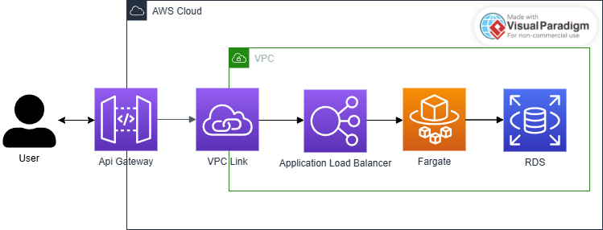

# Escopo do Projeto
Nos subtópicos seguintes contém detalhes sobre o objetivo do projeto, requisitos técnicos e endpoints.

## Objetivo do Projeto:
Desenvolver uma aplicação web usando o framework Flask para realizar operações CRUD
(Create, Read, Update, Delete) em uma entidade de "Usuário". O candidato deve persistir
os dados no banco de dados SQLite.

## Requisitos Técnicos:
1. Utilizar Flask (ou FastAPI) como framework.
2. Utilizar o conceito de orientação a objetos no desenvolvimento da aplicação.
3. Persistir os dados em um banco de dados SQLite.
4. Implementar as operações CRUD para a entidade "Usuário" (GET, POST, PUT, DELETE).
5. Implementar testes unitários
6. O código deve ser bem estruturado e seguir as melhores práticas de programação.

## Endpoints:
1. `GET /users`: Retorna a lista de todos os usuários.
2. `GET /users/{id}`: Retorna os detalhes de um usuário específico.
3. `POST /users`: Adiciona um novo usuário.
4. `PUT /users/{id}`: Atualiza os dados de um usuário existente.
5. `DELETE /users/{id}`: Remove um usuário.

# Instruções
Nos subtópicos seguintes, contém informações de como executar localmente esse projeto, rodar testes unitários e levantar esse projeto via Docker.
## Execução em ambiente local
1. É necessário a presença de POETRY na máquina para ativar o ambiente Python e dependências para execução desse projeto.
2. Com POETRY disponível, execute o comando `poetry install` na pasta raiz do projeto (em que está o arquivo `pyproject.toml`) para realizar a instalação de todas as dependências listadas dentro do arquivo `pyproject.toml`.
3. Execute o comando `poetry shell` na pasta raiz do projeto (em que está o arquivo `pyproject.toml`) para ativação do ambiente virtual com Python na versão 3.12 e dependências.
4. Execute o comando `python -m db.init_db` para gerar o banco de dados SQLite localmente e popula-lo com dados fictícios na tabela User. 
5. Execute o comando `uvicorn api.app:app --host 0.0.0.0 --port 8080` para ativar a API.

Observação: Se o `database.db` já estiver presente dentro da pasta `db`, o passo 4 não é necessário. Caso seja executado com o banco existente, mais registros fictícios serão adicionados ao banco de dados.

Você pode executar o comando `make` que os passos indicados serão executados automaticamente pelo Makefile.

Para realizar requisições utilize a url base: "http://0.0.0.0:8080". Exemplo: `GET http://0.0.0.0:8080/api/v1/users/`
## Execução de Testes Unitários
Com o ambiente virtual ativado, execute `pytest -v tests` para execução de todos os testes unitários. Para executar os testes com relatório de cobertura, execute `coverage run --source=. -m pytest -v tests && coverage report -m`.

## Execução via Docker
Para executar a API dentro de um container no Docker, estando com o Docker inicializado, basta executar o comando `docker-compose up`. Vale lembrar que como o banco de dados é SQLite, o banco de dados ficará dentro do mesmo serviço que a API do FastApi. 

Para evoluções futuras, imaginando outros bancos de dados como PostgreSQL é interessante separar o serviço do banco de dados do serviço de API, utilizando uma network bridge para estabelecer uma conexão entre os serviços do container.

Esse desacoplamento será útil na evolução do projeto para nuvem, em que o contexto de dados poderá ser localizado em serviços externos, como AWS RDS, Cloud SQL, etc..

Para realizar requisições utilize a url base: "http://localhost:8080". Exemplo: `GET http://localhost:8080/api/v1/users/`
# Detalhes do Projeto
Nos subtópicos seguintes, apresento detalhes da arquitetura e implementação desse projeto.
## Arquitetura e Padrões de Projeto
Para construção desse projeto foram utilizados os seguintes padrões de projeto:
- MVC (model, view, controller): A Visão (View) é representada pelos retornos realizados pelo controller no ato de retornar o resultado do processamento da API construída pelo FastApi. Os Modelos (Models) que representam as entidades do projeto, auxiliando no acesso de camada de dados (DAL). O Controlador (Controller) estabelece as rotas de usuário direcionando o processamento das requisições de acordo com o método HTTP juntamente com o endpoint dentro da solicitação do usuário.
- Repository: Realiza o isolamento da camada de acesso de dados (DAL), podendo ser separada em torno do domínio e contexto de banco de dados. Além disso, realiza o desacomplamento em torno da camada de serviço, que nesse padrão, realizará lógicas internas atreladas as regras de negócio como aspectos de infraestrutura. Esse padrão é exibido abaixo:

- Singleton: garante que apenas uma instância de uma classe exista em um sistema, sendo utilizada na camada de cliente com banco de dados, fornecendo um ponto de acesso global a essa instância. 

O fluxo dentro do projeto ficou da seguinte forma:


Além disso, no desenvolvimento do projeto, foram utilizados os principios SOLID para facilitar a manutenção e a expansão do software.

No final, o diagrama de classes que resume a implementação central desse projeto é representando da seguinte forma (padrão UML):


## Dependências e Frameworks
- No gerenciamento de dependência e virtualização do ambiente foi utilizado o Poetry, facilitando esse processo e permitindo uma melhor forma de transportar esse ambiente para outros locais.
- Para construção da API foi utilizado o framework FastAPI. 
- Envolvendo validações do corpo de requisições e respostas foi utilizado o Pydantic
- Para construção dos testes unitários, foi utilizado o Pytest.
- Conexão com banco de dados e modelagem, foi utilizado o SQLAlchemy.
- Para gerar dados fictícios e popular o banco foi utilizado o Faker, juntamente com o SQLAlchemy (`db/init_db.py`).

### Diagramação
Para diagramação, foi utilizada a ferramenta [PlantUML](https://plantuml.com), com [extensão](https://marketplace.visualstudio.com/items?itemName=jebbs.plantuml) disponível no Visual Studio Code, permitindo construção de diagramas via linha de código, facilitando o versionamento, assim como na produtividade.

Os diagramas estão disponíveis em `docs`.

### Documentação dos Cenários de Testes
Para mapear os cenários de testes e os comportamentos esperados para cada situação dentro das funcionalidades desse projeto foi utilizado o [Gherkin](https://cucumber.io/docs/gherkin/), assim padronizando a forma de escrever especificações de cenários, baseado na regra de negócio.

Essas documentações estão disponíveis em `tests/scenarios`. 

Gherkin possui [extensão](https://marketplace.visualstudio.com/items?itemName=alexkrechik.cucumberautocomplete) no Visual Studio Code, facilitando o processo de escrita e padronização.

## Padrões de Git
Para seguir boas práticas de Git foram utilizados Commits Atômicos, seguindo o padrão [Conventional Commits](https://www.conventionalcommits.org/en/v1.0.0/), combinado ao padrão [gitmoji](https://gitmoji.dev).

O padrão principal para mensagens de commit nesse projeto é
```
[emoji] <type>[optional scope]: <description>
```

Exemplo:
```
♻️ refactor(sqlite_user_repository): improve efficiency of update
```

O idioma utilizado por padrão foi o inglês, para combinar com o nome dos módulos, funções, etc... que também seguiram esse mesmo idioma padrão.

## Comportamento da API
Para construção da lógica de como a API deveria reagir aos diferentes cenários de requisições em torno da lógica CRUD, atrelado ao método HTTP e endpoint, foi seguido a específicação [JSONApi (v1.1)](https://jsonapi.org/format). A intenção é facilitar o uso da API por outros desenvolvedores seguindo um padrão mais universal.

## Logging
O serviço de logging é utilizado na camada de serviço, para auxiliar na detecção de falhas inesperadas, exibir isso de forma mais documentada no log e direcionar elas da melhor forma para o Controller e assim construir uma View de forma mais eficiente nesses cenários. Além disso, o serviço de logging também auxilia nos casos bem sucedidos, realizando uma documentação dos processamentos de requisição.

A configuração do logging foi realizada em `infra/log_config.py` em que é criado o `LogService` para auxiliar na orquestração de handlers de log na camada de serviço, assim como a disponibilidade de decoradores `handle_exception` para, de forma padronizada, incluir a manipulação de exceptions nos métodos da camada de serviço.

# Evoluções do Projeto
## Melhorias futuras do projeto - nível código:
Visando o longo prazo, coloco alguns pontos de evolução possíveis para esse projeto:
- Utilizar classes padrões (classes Exception) para controlar os erros internos detectados pela checagens de repositório e service, para auxiliar na padronização, reuso e obter mais detalhes da falha, em vez de passar as strings diretamente.
- Evoluir a lógica do logging para auxiliar no registro de execuções e processamentos de requisições, com um track_id gerado para cada requisição, assim como detalhes do payload de processamento, detalhes dos erros. Essas informações também podem ser incorporadas na response da requisição (em caso de falhas detectadas). 
- Evoluir a cobertura de testes (coverage) para cobrir mais cenários de falhas.
- Melhorar o gerenciamento de contexto da classe SQLiteClient.
- Adicionar possibilidade de paginação no processo de selecionar todos os usuários, assim como query parameters para controlar essa paginação ou colocar limites (isso seria muito bom imaginando casos de muitos usuários na tabela). Padrão: `/?page[offset]=0&page[limit]=10`
- Dentro da função `__handle_error_response_from_service` no `UserController` pode ser feito uma Factory para melhorar a orquestração de erros, sendo útil principalmente em um cenário de evolução no número de possíveis falhas detectadas (o que no cenário atual provocaria uma grande quantidade de condicionais). Uma outra alternativa de melhoria no curto prazo seria o uso de `match case` em vez de condicionais.
- Corrigir pendências do `flake8`.

## Evolução para Outras Entidades
Imaginando o cenário de termos mais bancos de dados no contexto de User, seria apenas necessário realizar outras implementações para a `IUserRepository` para adaptar ao diferente contexto. Pois todas as classes (do contexto `User` como a `UserService`) dependem da interface `IUserRepository`.

Já para agregar outras entidades diferente da User, seria necessário replicar uma arquitetura similar para essa entidade. Podemos construir interfaces gerais para representar uma ideia central de `repository` que será uma super classe para as interfaces mais específicas.

## Evolução para Cloud
Para evoluir para uma Cloud como AWS, poderemos utilizar algo mais centralizado como um serviço ECS para hospedar o container da aplicação da API, considerando apenas a separação do contexto do banco de dados (que na AWS poderia ser utilizado o AWS RDS, por exemplo).

Para um contexto mais desentralizado, em que é necessário ter uma maior possibilidade de ramificação da API em microserviços como melhor direcionamento das requisições, podemos utilizar o conjunto: API Gateway, VPC Link, Application Load Balance, Fargate e RDS.



- Api Gateway: Funcionará como o ponto de entrada das requisições, realizando o gerenciamento de autenticação, cache e controle de tráfego, direcionando o processamento da requisição para microserviços específicos.

- VPC Link: permitirá o direcionamento do API Gateway para outros microserviços dentro de uma VPC, permitindo uma comunicação mais segura.

- Application Load Balancer: Irá distribuir o tráfego entre diferentes instâncias, para balancear o processamento e auxiliar no gerenciamento de sobrecarga em grandes volumes de requisições simultâneas.

- Fargate: irá hospedar o container da API via Docker, integrando ao ALB e sem muitas preocupações de servidores, mas permitindo gerenciamento de aspectos como o AutoScalling para auxiliar na escala.

- Amazon RDS: Serviço de Banco de Dados Relacional Gerenciado (apenas supondo que o banco produtivo fosse dentro da mesma VPC nessa arquitetura).