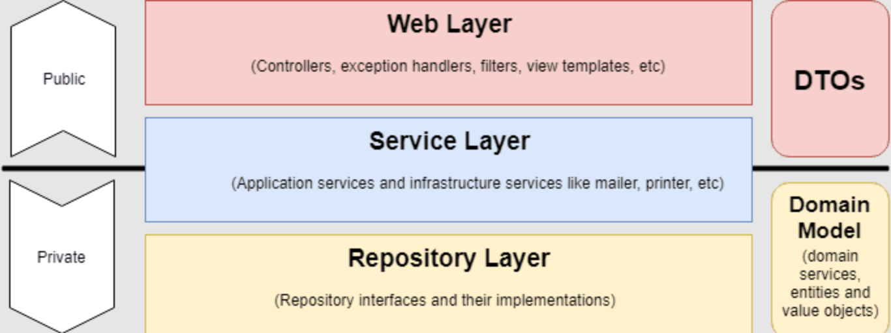
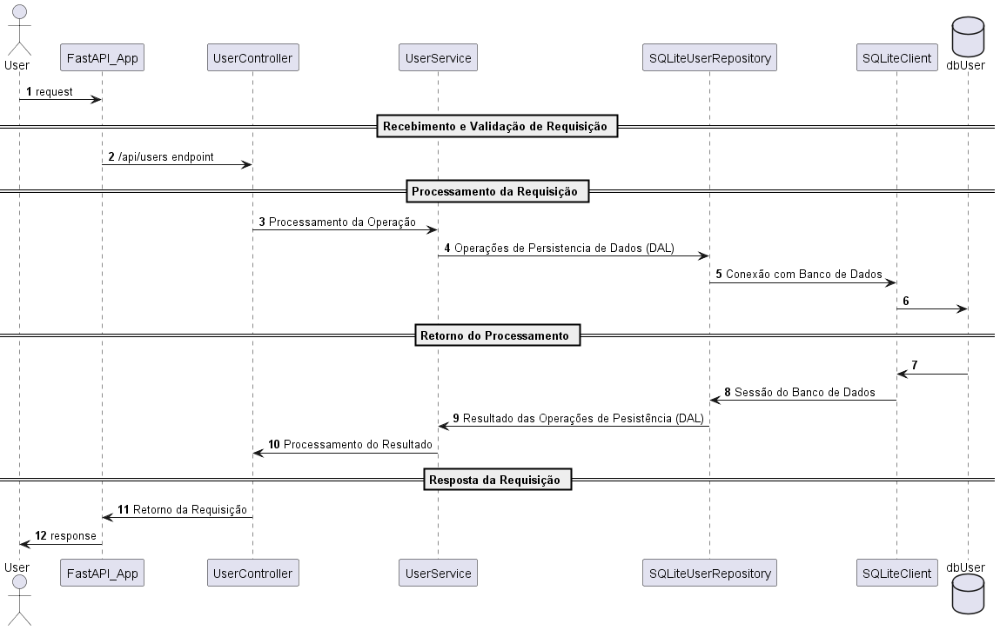
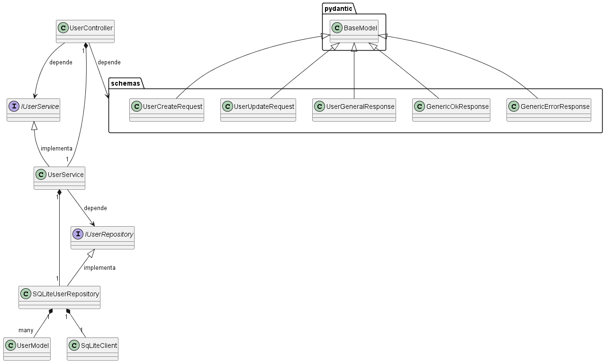

# Escopo do Projeto
Nos subtópicos seguintes contém detalhes sobre o objetivo do projeto, requisitos técnicos e endpoints.

## Objetivo do Projeto:
Desenvolver uma aplicação web usando o framework Flask para realizar operações CRUD
(Create, Read, Update, Delete) em uma entidade de "Usuário". O candidato deve persistir
os dados no banco de dados SQLite.

## Requisitos Técnicos:
1. Utilizar Flask (ou FastAPI) como framework.
2. Utilizar o conceito de orientação a objetos no desenvolvimento da aplicação.
3. Persistir os dados em um banco de dados SQLite.
4. Implementar as operações CRUD para a entidade "Usuário" (GET, POST, PUT, DELETE).
5. Implementar testes unitários
6. O código deve ser bem estruturado e seguir as melhores práticas de programação.

## Endpoints:
1. `GET /users`: Retorna a lista de todos os usuários.
2. `GET /users/{id}`: Retorna os detalhes de um usuário específico.
3. `POST /users`: Adiciona um novo usuário.
4. `PUT /users/{id}`: Atualiza os dados de um usuário existente.
5. `DELETE /users/{id}`: Remove um usuário.

# Instruções
Nos subtópicos seguintes, contém informações de como executar localmente esse projeto, rodar testes unitários e levantar esse projeto via Docker.
## Execução em ambiente local
1. É necessário a presença de POETRY na máquina para ativar o ambiente Python e dependências para execução desse projeto.
2. Com POETRY disponível, execute o comando `poetry install` na pasta raiz do projeto (em que está o arquivo `pyproject.toml`) para realizar a instalação de todas as dependências listadas dentro do arquivo `pyproject.toml`.
3. Execute o comando `poetry shell` na pasta raiz do projeto (em que está o arquivo `pyproject.toml`) para ativação do ambiente virtual com Python na versão 3.12 e dependências.
4. Execute o comando `python -m db.init_db` para gerar o banco de dados SQLite localmente e popula-lo com dados fictícios na tabela User.
5. Execute o comando `uvicorn api.app:app --host 0.0.0.0 --port 8080` para ativar a API.

## Execução de Testes Unitários
Com o ambiente virtual ativado, execute `pytest -v tests` para execução de todos os testes unitários. Para executar os testes com relatório de cobertura, execute `coverage run --source=. -m pytest -v tests && coverage report -m`.

## Execução via Docker

# Detalhes do Projeto
Nos subtópicos seguintes, apresento detalhes da arquitetura e implementação desse projeto.
## Arquitetura e Padrões de Projeto
Para construção desse projeto foram utilizados os seguintes padrões de projeto:
- MVC (model, view, controller): A Visão (View) é representada pela aplicação principal da API construída pelo fastapi com o swagger disponível. Os Modelos (Models) que representam as entidades do projeto, auxiliando no acesso de camada de dados (DAL). O Controlador (Controller) estabelece as rotas de usuário direcionando o processamento das requisições de acordo com o método HTTP juntamente com o endpoint dentro da solicitação do usuário.
- Repository: Realiza o isolamento da camada de acesso de dados (DAL), podendo ser separada em torno do domínio e contexto de banco de dados. Além disso, realiza o desacomplamento em torno da camada de serviço, que nesse padrão, realizará lógicas internas atreladas as regras de negócio como aspectos de infraestrutura. Esse padrão é exibido abaixo:

- Singleton: garante que apenas uma instância de uma classe exista em um sistema, sendo utilizada na camada de cliente com banco de dados, fornecendo um ponto de acesso global a essa instância. 

O fluxo dentro do projeto ficou da seguinte forma:

Além disso, no desenvolvimento do projeto, foram utilizados os principios SOLID para facilitar a manutenção e a expansão do software.

No final, o diagrama de classes que resume a implementação central desse projeto é representando da seguinte forma (padrão UML):

## Dependências e Frameworks
- No gerenciamento de dependência e virtualização do ambiente foi utilizado o Poetry, facilitando esse processo e permitindo uma melhor forma de transportar esse ambiente para outros locais.
- Para construção da API foi utilizado o framework FastAPI. 
- Envolvendo validações do corpo de requisições e respostas foi utilizado o Pydantic
- Para construção dos testes unitários, utilizamos o Pytest.
- Conexão com banco de dados e modelagem, utilizamos o SQLAlchemy.
# Evoluções do Projeto
## Melhorias futuras do projeto - nível código:
Visando o longo prazo, coloco alguns pontos de evolução possíveis para esse projeto:
- Utilizar classes padrões para controlar os erros internos detectados pela checagens de repositório e service, para auxiliar na padronização, reuso e obter mais detalhes da falha.
- Utilizar logging para auxiliar no registro de execuções e processamentos de requisições, com um track_id gerado para cada requisição, assim como detalhes do payload de processamento, detalhes dos erros. Essas informações também podem ser incorporadas na response da requisição (em caso de falhas detectadas). 
- Evoluir a cobertura de testes (coverage) para obter algo entre 80-90%.
- Melhorar o gerenciamento de contexto da classe SQLiteClient.
- Adicionar possibilidade de paginação no processo de selecionar todos os usuários, assim como query parameters para controlar essa paginação ou colocar limites (isso seria muito bom imaginando casos de muitos usuários na tabela). Padrão: `/?page[offset]=0&page[limit]=10`